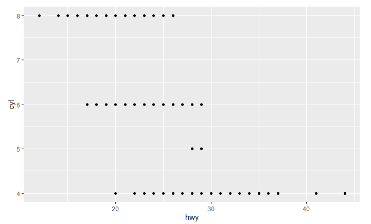

```{r setup, include=FALSE}
knitr::opts_chunk$set(echo = TRUE)
```

## Git, GitHub

1. *What is your GitHub username?*

SaumyaDabhi

2. *What is the URL of your remote GitHub repo (created through Mr. Kennedy's exercises)?*

git@github.com:SaumyaDabhi/git-workshop.git

## R

The command below will load the tidyverse package.  If you have installed R, RStudio, and the tidyverse package, it should display a list of loaded packages and their versions.
```{r}
library(tidyverse)
```

## R Markdown

1. *Create a bulleted list with at least 3 items*
- car
- bike
- bus
- taxi

2. *Write a single paragraph that demonstrates the use of italics, bold, bold italics, code, and includes a link. The paragraph does not have to make sense.*

Lorem ipsum **dolor sit** amet, consectetur adipiscing elit, *sed do eiusmod tempor* incididunt ut labore et dolore magna aliqua. Ut enim ad minim veniam, ***quis nostrud exercitation ullamco*** laboris nisi ut aliquip ex ea commodo consequat. Duis aute irure dolor in reprehenderit `{r pressure, echo=FALSE} plot(pressure)` in voluptate velit esse cillum dolore eu fugiat nulla pariatur. Excepteur sint occaecat cupidatat non proident [syntax](https://www.markdownguide.org/basic-syntax), sunt in culpa qui officia deserunt mollit anim id est laborum.


3. *Create a level 3 heading*

### Heading level 3

## R

#### Data Visualization Exercises

1. (Q2) *How many rows are in mpg? How many columns?*
```{r}
ggplot2::mpg
```
rows: 234
column: 11

1. (Q4) *Make a scatterplot of hwy vs cyl.*
```{r}
ggplot(data = mpg) + 
  geom_point(mapping = aes(x = hwy, y = cyl))
```



#### Workflow: basics Exercises

1. (Q2) *Tweak each of the following R commands so that they run correctly (`library(tidyverse)` is correct):*

```r
library(tidyverse)

ggplot(data = mpg) +
  geom_point(mapping = aes(x = displ, y = hwy))

filter(mpg, cyl == 8)

filter(diamonds, carat > 3)
```

## Google Colab

1. *What are the URLs of your Google Colab notebooks (both Python and R)?*

URL of Python:-
https://colab.research.google.com/drive/1u3vSAvNR1kpBK8tVLRv9sbaN2DWoQdYP?usp=sharing

URL of R:-
https://colab.research.google.com/drive/1MTM4UYCWpaRf-NJI8AfrBcZ69f9ukRF2?usp=sharing

## Tableau

*Insert your the image of your final bar chart here*


1. *What conclusions can you draw from the chart?*

Binders sales had negative profit in 2021.

## Observable and Vega-Lite

### A Taste of Observable

1. *In the "New York City weather forecast" section, try replacing `Forecast: detailedForecast` with `Forecast: shortForecast`. Then press the blue play button  or use Shift-Return to run your change. What happens?*

1. *Under the scatterplot of temperature vs. name, try replacing `markCircle()` with `markSquare()`. Then press the blue play button  or use Shift-Return to run your change. What happens? How about `markPoint()`?*

1. *Under "Pick a location, see the weather forecast", pick a location on the map.  Where was the point you picked near?*

1. *The last visualization on this page is a "fancy" weather chart embedded from another notebook.  Click on the 3 dots next to that chart and choose 'Download PNG'.  Insert the PNG into your report.*

### Charting with Vega-Lite

`markCircle()`

1. *Pass an option of `{ size: 200 }` to `markCircle()`.*

The size of the circles gets bigger.


1. *Try `markSquare` instead of `markCircle`.*

The circles changes to squares.


1. *Try `markPoint({ shape: 'diamond' })`.*

The squares are now diamonds with default size.


`vl.x().fieldQ("Horsepower")`, ...

1. *Change `Horsepower` to `Acceleration`*

As the Acceleration increases the the Miles_per_Gallon is also increasing(disregarding some points).


1. *Swap what fields are displayed on the x- and y-axis*

The result is same just the axis value swapped.


`vl.tooltip().fieldN("Name")`

1. *Change `Name` to `Origin`.*

While tapping on data points it shows country instead of the car model name.

Another example, `count()`

1. *Remove the `vl.y().fieldN("Origin")` line.*

It shows an ungrouped count.


1. *Replace `count()` with `average("Miles_per_Gallon")`.*

Now its average of miles per gallon on x axis instead of count where Japan has higher average of miles per gallon, then Europe then USA.


## References

*Every report must list the references that you consulted while completing the assignment. If you consulted a webpage, you must include the URL.*

* Reference 1, https://rmarkdown.rstudio.com/lesson-4.html
* Reference 2, https://www.markdownguide.org/basic-syntax
* Reference 3, https://rpubs.com/Rtudes/RMarkdownBasics
* Reference 4, https://community.rstudio.com/t/rmd-install-packages-best-practices/42591/3


