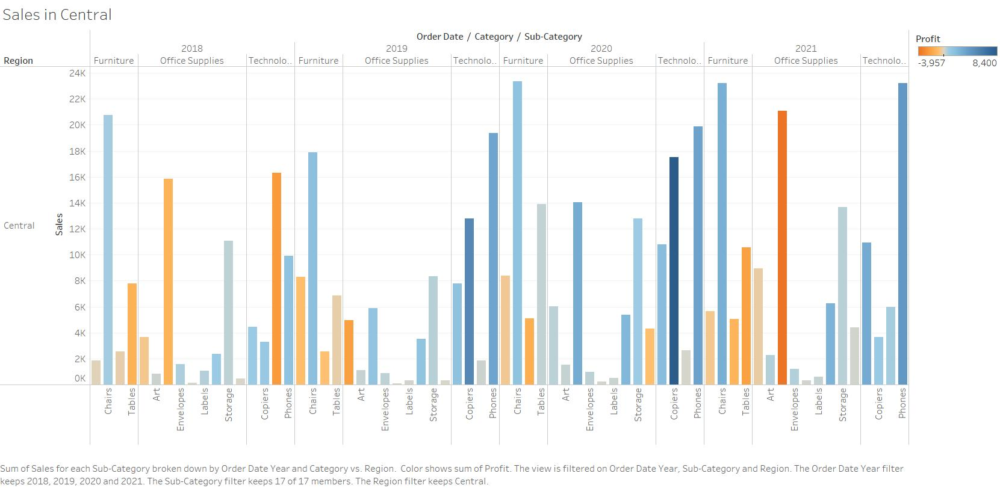
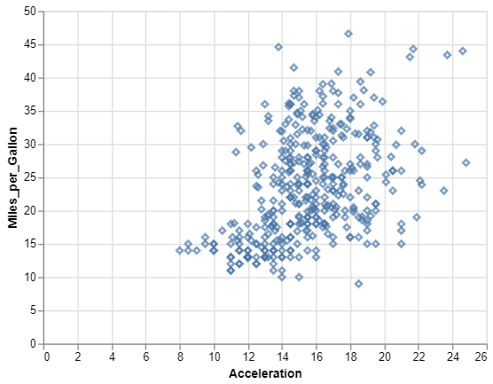
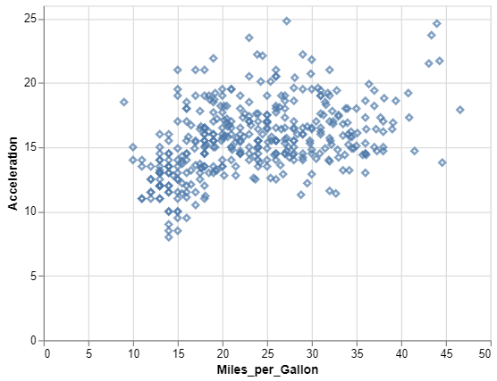

HW 1, CS 625, Spring 2022
================
Saumya Dabhi
Jan 20, 2022

## Git, GitHub

1.  *What is your GitHub username?*

SaumyaDabhi

2.  *What is the URL of your remote GitHub repo (created through
    Mr. Kennedy’s exercises)?*

<git@github.com>:SaumyaDabhi/git-workshop.git

## R

The command below will load the tidyverse package. If you have installed
R, RStudio, and the tidyverse package, it should display a list of
loaded packages and their versions.

``` r
library(tidyverse)
```

    ## -- Attaching packages --------------------------------------- tidyverse 1.3.1 --

    ## v ggplot2 3.3.5     v purrr   0.3.4
    ## v tibble  3.1.6     v dplyr   1.0.7
    ## v tidyr   1.1.4     v stringr 1.4.0
    ## v readr   2.1.1     v forcats 0.5.1

    ## -- Conflicts ------------------------------------------ tidyverse_conflicts() --
    ## x dplyr::filter() masks stats::filter()
    ## x dplyr::lag()    masks stats::lag()

## R Markdown

1.  *Create a bulleted list with at least 3 items*

-   car
-   bike
-   bus
-   taxi

2.  *Write a single paragraph that demonstrates the use of italics,
    bold, bold italics, code, and includes a link. The paragraph does
    not have to make sense.*

Lorem ipsum **dolor sit** amet, consectetur adipiscing elit, *sed do
eiusmod tempor* incididunt ut labore et dolore magna aliqua. Ut enim ad
minim veniam, ***quis nostrud exercitation ullamco*** laboris nisi ut
aliquip ex ea commodo consequat. Duis aute irure dolor in reprehenderit
`{r pressure, echo=FALSE} plot(pressure)` in voluptate velit esse cillum
dolore eu fugiat nulla pariatur. Excepteur sint occaecat cupidatat non
proident [syntax](https://www.markdownguide.org/basic-syntax), sunt in
culpa qui officia deserunt mollit anim id est laborum.

3.  *Create a level 3 heading*

### Heading level 3

## R

#### Data Visualization Exercises

1.  (Q2) *How many rows are in mpg? How many columns?*

``` r
ggplot2::mpg
```

    ## # A tibble: 234 x 11
    ##    manufacturer model      displ  year   cyl trans drv     cty   hwy fl    class
    ##    <chr>        <chr>      <dbl> <int> <int> <chr> <chr> <int> <int> <chr> <chr>
    ##  1 audi         a4           1.8  1999     4 auto~ f        18    29 p     comp~
    ##  2 audi         a4           1.8  1999     4 manu~ f        21    29 p     comp~
    ##  3 audi         a4           2    2008     4 manu~ f        20    31 p     comp~
    ##  4 audi         a4           2    2008     4 auto~ f        21    30 p     comp~
    ##  5 audi         a4           2.8  1999     6 auto~ f        16    26 p     comp~
    ##  6 audi         a4           2.8  1999     6 manu~ f        18    26 p     comp~
    ##  7 audi         a4           3.1  2008     6 auto~ f        18    27 p     comp~
    ##  8 audi         a4 quattro   1.8  1999     4 manu~ 4        18    26 p     comp~
    ##  9 audi         a4 quattro   1.8  1999     4 auto~ 4        16    25 p     comp~
    ## 10 audi         a4 quattro   2    2008     4 manu~ 4        20    28 p     comp~
    ## # ... with 224 more rows

rows: 234 column: 11

1.  (Q4) *Make a scatterplot of hwy vs cyl.*

``` r
ggplot(data = mpg) + 
  geom_point(mapping = aes(x = hwy, y = cyl))
```

<!-- -->


#### Workflow: basics Exercises

1.  (Q2) *Tweak each of the following R commands so that they run
    correctly (`library(tidyverse)` is correct):*

``` r
library(tidyverse)

ggplot(data = mpg) +
  geom_point(mapping = aes(x = displ, y = hwy))

filter(mpg, cyl == 8)

filter(diamonds, carat > 3)
```

## Google Colab

1.  *What are the URLs of your Google Colab notebooks (both Python and
    R)?*

URL of Python:-
<https://colab.research.google.com/drive/1u3vSAvNR1kpBK8tVLRv9sbaN2DWoQdYP?usp=sharing>

URL of R:-
<https://colab.research.google.com/drive/1MTM4UYCWpaRf-NJI8AfrBcZ69f9ukRF2?usp=sharing>

## Tableau

*Insert your the image of your final bar chart here*



1.  *What conclusions can you draw from the chart?*

Binders sales had negative profit in 2021.

## Observable and Vega-Lite

### A Taste of Observable

1.  *In the “New York City weather forecast” section, try replacing
    `Forecast: detailedForecast` with `Forecast: shortForecast`. Then
    press the blue play button or use Shift-Return to run your change.
    What happens?*

2.  *Under the scatterplot of temperature vs. name, try replacing
    `markCircle()` with `markSquare()`. Then press the blue play button
    or use Shift-Return to run your change. What happens? How about
    `markPoint()`?*

3.  *Under “Pick a location, see the weather forecast”, pick a location
    on the map. Where was the point you picked near?*

4.  *The last visualization on this page is a “fancy” weather chart
    embedded from another notebook. Click on the 3 dots next to that
    chart and choose ‘Download PNG’. Insert the PNG into your report.*

### Charting with Vega-Lite

`markCircle()`

1.  *Pass an option of `{ size: 200 }` to `markCircle()`.*

The size of the circles gets bigger. 

1.  *Try `markSquare` instead of `markCircle`.*

The circles changes to squares. 

1.  *Try `markPoint({ shape: 'diamond' })`.*

The squares are now diamonds with default size. 

`vl.x().fieldQ("Horsepower")`, …

1.  *Change `Horsepower` to `Acceleration`*

As the Acceleration increases the the Miles_per_Gallon is also
increasing(disregarding some points). 

1.  *Swap what fields are displayed on the x- and y-axis*

The result is same just the axis value swapped. 

`vl.tooltip().fieldN("Name")`

1.  *Change `Name` to `Origin`.*

While tapping on data points it shows country instead of the car model
name.

Another example, `count()`

1.  *Remove the `vl.y().fieldN("Origin")` line.*

It shows an ungrouped count. 

1.  *Replace `count()` with `average("Miles_per_Gallon")`.*

Now its average of miles per gallon on x axis instead of count where
Japan has higher average of miles per gallon, then Europe then USA.


## References

*Every report must list the references that you consulted while
completing the assignment. If you consulted a webpage, you must include
the URL.*

-   Reference 1, <https://rmarkdown.rstudio.com/lesson-4.html>
-   Reference 2, <https://www.markdownguide.org/basic-syntax>
-   Reference 3, <https://rpubs.com/Rtudes/RMarkdownBasics>
-   Reference 4,
    <https://community.rstudio.com/t/rmd-install-packages-best-practices/42591/3>
